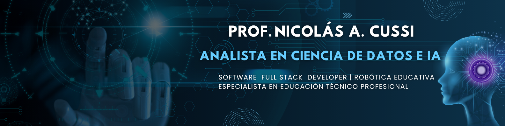

# Prof. Nicolás A. Cussi 💻

### DEV • DATA SCIENCE • IA

## Técnico Superior en Ciencia de Datos e IA y Docente del área de Programación, con experiencia en todas las materias de la especialidad: Programación, Lógica, Desarrollo de Software, Bases de Datos, Redes y Robótica. Sólida trayectoria en educación técnica.

<!--
**Prof-NkoCussi/Prof-NkoCussi** is a ✨ _special_ ✨ repository because its `README.md` (this file) appears on your GitHub profile.

Here are some ideas to get you started:

- 🔭 I’m currently working on ...
- 🌱 I’m currently learning ...
- 👯 I’m looking to collaborate on ...
- 🤔 I’m looking for help with ...
- 💬 Ask me about ...
- 📫 How to reach me: ...
- 😄 Pronouns: ...
- ⚡ Fun fact: ...
-->
